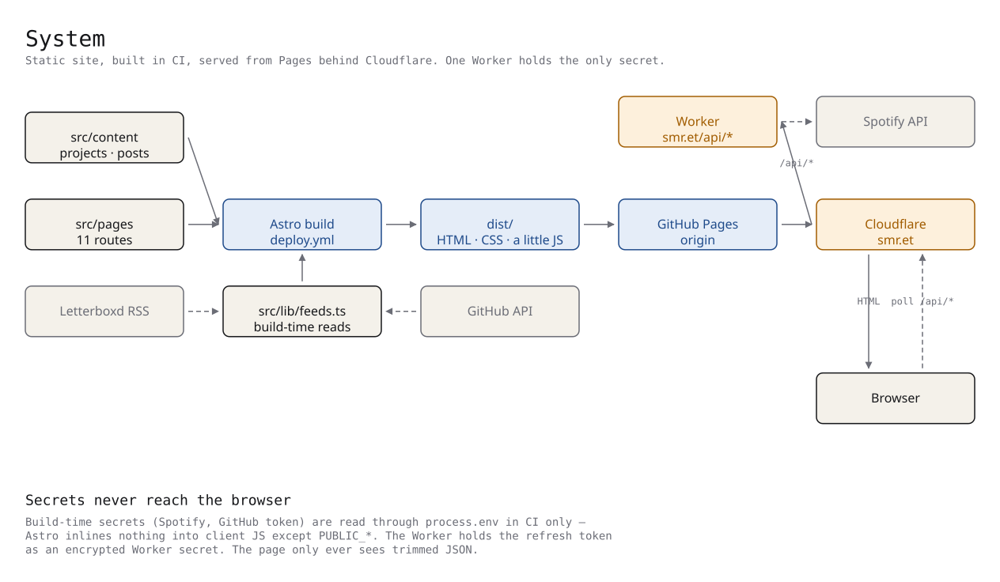
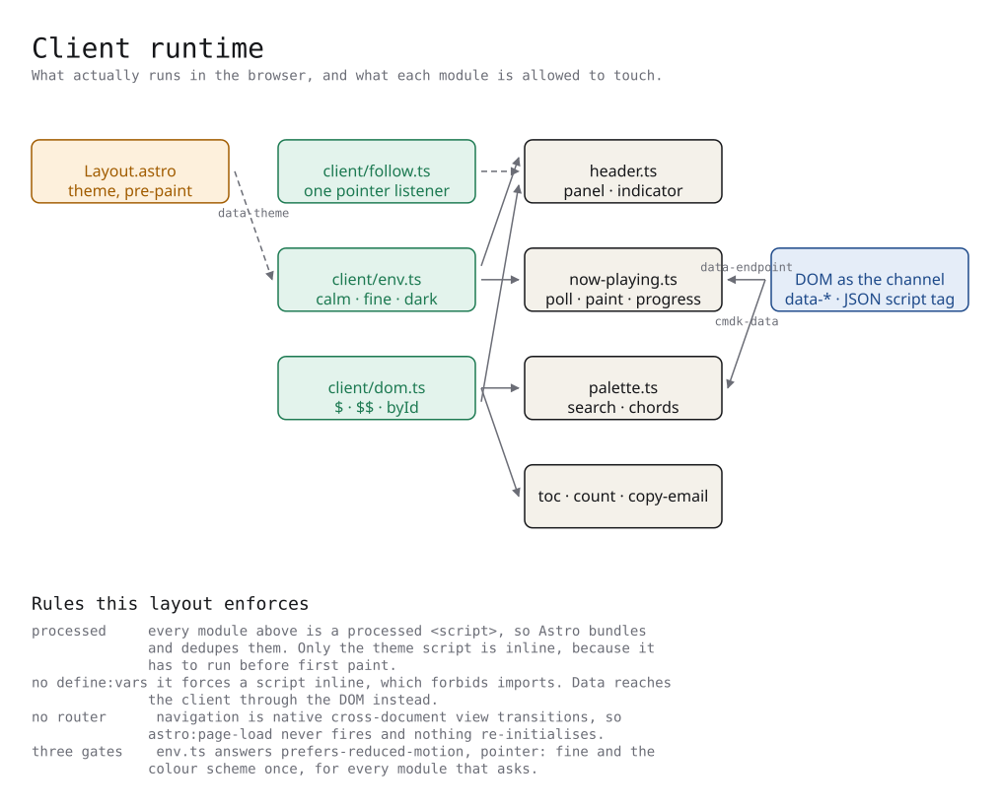
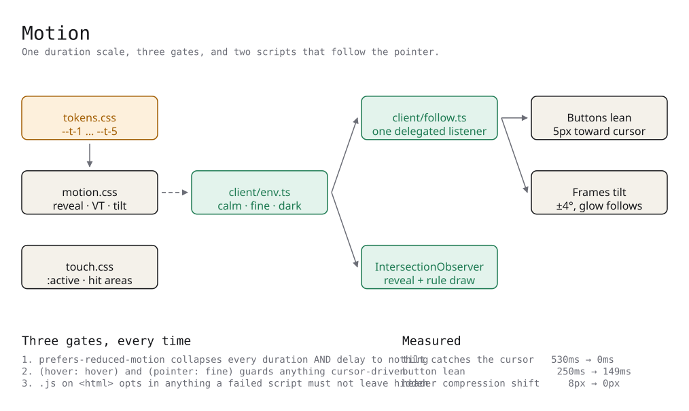
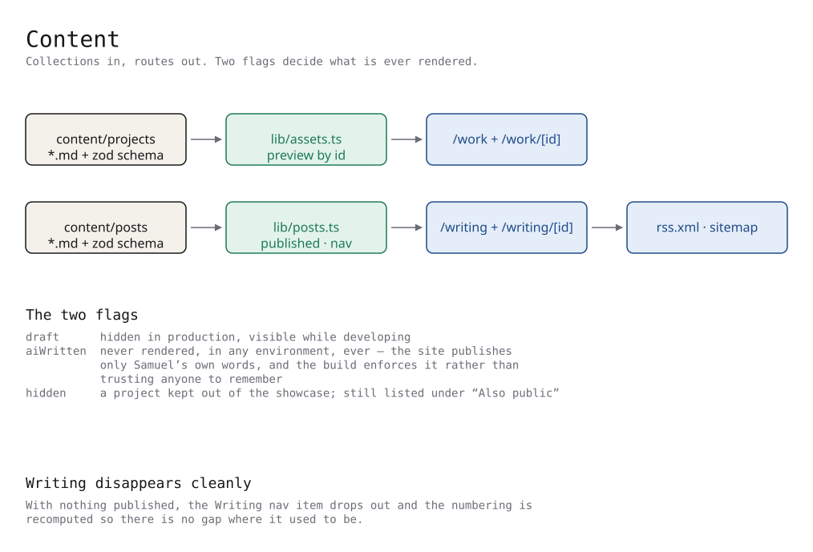
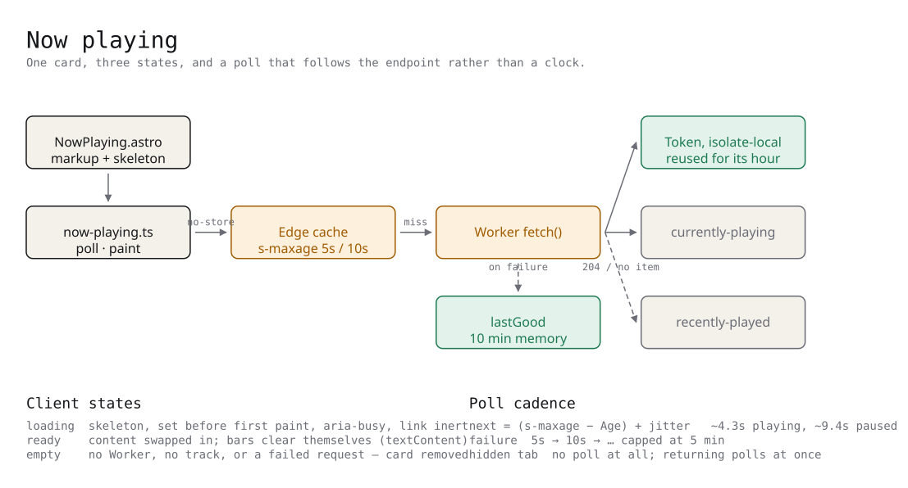
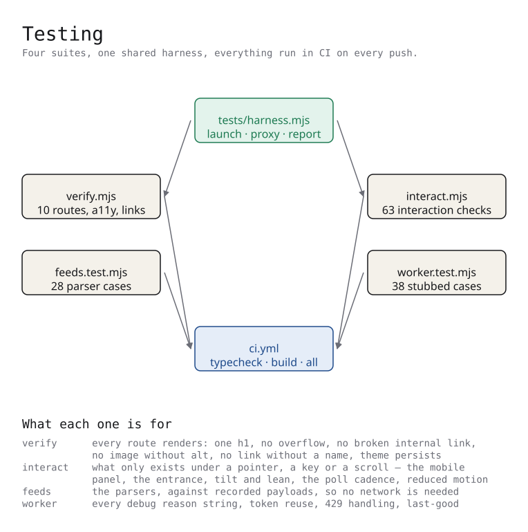

# Architecture

How smr.et is built, why it is built that way, and where each decision lives in
the code. Each section carries its diagram inline.

The diagrams live in [`docs/diagrams/`](./diagrams) and are written twice: an
`.excalidraw` scene to edit — open it at
[excalidraw.com](https://excalidraw.com) with **File → Open** — and an `.svg`
to read, which is what is embedded below. Both are generated from
[`scenes.mjs`](./diagrams/scenes.mjs), so they are regenerated rather than
redrawn when something moves:

```sh
npm run diagrams
```

| Scene               | Level | What it shows                                                 |
| ------------------- | ----- | ------------------------------------------------------------- |
| `01-system`         | High  | Build, deploy, serve, and where the secrets are               |
| `02-now-playing`    | Code  | The Worker's fetch path, the token cache, and the client poll |
| `03-motion`         | Code  | The duration scale, the three gates, the two pointer scripts  |
| `04-content`        | Code  | Collections in, routes out, and the flags that gate rendering |
| `05-testing`        | Code  | The four suites, the shared harness, what each one covers     |
| `06-client-runtime` | Code  | Every module that runs in the browser and what it may touch   |

[How to edit them](./diagrams/README.md), and
[what Excalidraw itself is](./excalidraw.md) — the element model these scenes
are written against, its component API and its encryption.

---

## 1. The shape of the thing



A personal site for a software engineer: eleven routes, no client framework, no
analytics, no cookies. Astro 7 renders everything to static HTML at build time;
Tailwind 4 supplies the utility layer over a hand-written design system. The
output is HTML, one stylesheet, and a few kilobytes of JavaScript that only ever
_adds_ behaviour to a page that already works without it.

```
src/
  pages/           11 routes, including two dynamic ([...id]) collections
  components/      markup; behaviour lives in lib/client
  layouts/         one Layout, which every page goes through
  lib/             build-time helpers (feeds, posts, site, assets)
  lib/client/      the browser runtime, shared by every component
  content/         projects and posts as Markdown + a zod schema
  styles/          the design system, split by concern
  data/            hand-maintained lists (stack, experience)
worker/            the Cloudflare Worker behind /api/*
scripts/           build-adjacent tooling (screenshots, OAuth, images)
tests/             three browser/node suites plus a shared harness
docs/              this file and the diagrams
```

### Why static

Everything on the site is either known at build time or genuinely live. The
known parts — projects, posts, the stack, the CV — are content files. The one
genuinely live thing is what he is listening to, and that is a single `fetch`
to a Worker. There is no middle category, so there is no server.

The cost is that anything wanting fresh data needs a rebuild; the deploy
workflow runs daily at 05:00 UTC for exactly that reason, so the GitHub and
Letterboxd feeds on `/now` stay current without a push.

---

## 2. Rendering and navigation

**No client-side router.** Navigation is ordinary document navigation. The page
transitions come from the CSS `@view-transition { navigation: auto }`
declaration in `motion.css`, which is the _cross-document_ form: the browser
loads the next document and animates between the two. Elements that share a
`view-transition-name` morph — the ink field behind the hero and every page
header carry `view-transition-name: field`, so the field appears to grow from
one page into the next.

This has a consequence worth stating, because it caught us: **`astro:page-load`
never fires.** That event is emitted by Astro's `<ClientRouter />`, which this
site does not use. Eight components had listened for it, and each carried a
`dataset.bound` or `window.__*` guard so that re-initialisation would be
idempotent. None of it could ever run. It is all gone; scripts now initialise
once, on the one page load they get.

**Scripts are processed, not inline.** Astro bundles, dedupes and defers a plain
`<script>`, and — the point — lets it `import`. Only two things stay
`is:inline`:

- the theme resolver in `Layout.astro`, which must run before first paint or
  the page flashes the wrong theme;
- nothing else.

Data that used to force `define:vars` (and therefore an inline script) now
rides on the DOM instead: the now-playing endpoint is a `data-endpoint`
attribute, the command palette's index is a `<script type="application/json">`
block, the console easter egg reads the address from `<html data-email>`.

---

## 3. The client runtime



`src/lib/client/` is the shared browser code. Before it, every component script
opened its own `matchMedia`, wrote its own `getElementById` cluster, and
re-implemented the same pointer bookkeeping.

| Module           | Responsibility                                                                                  |
| ---------------- | ----------------------------------------------------------------------------------------------- |
| `env.ts`         | The three media queries, asked once: `calm`, `fine`, `dark`, plus `mayMove()` and `mayFollow()` |
| `dom.ts`         | `$`, `$$`, `byId` — typed, so a script is not three casts deep before it starts                 |
| `follow.ts`      | One delegated pointer-follow used by both the leaning buttons and the tilting frames            |
| `time.ts`        | `clock(ms)` and `since(iso)`                                                                    |
| `header.ts`      | The mobile disclosure panel and the sliding nav indicator                                       |
| `now-playing.ts` | The card: poll, paint, progress                                                                 |
| `palette.ts`     | The ⌘K command palette                                                                          |

### `follow()` is the interesting one

Two behaviours were written twice over — a button that leans toward the cursor
and a project frame that tilts under it — and they differ only in what they do
with the position. `follow(selector, move, settle)` owns the part that was
identical: one delegated listener rather than a pair per element, passive so it
never blocks a scroll, the bookkeeping to settle the element being left, and
the gate on pointer and motion preferences. `move` is handed the element and
the pointer's position within it as two fractions from 0 to 1.

```ts
follow(
  '.btn',
  (btn, x, y) => {
    btn.setAttribute('data-lean', '');
    btn.style.translate = `${(x - 0.5) * 2 * REACH}px ${(y - 0.5) * 2 * REACH}px`;
  },
  (btn) => {
    btn.removeAttribute('data-lean');
    btn.style.translate = '';
  },
);
```

`data-lean` and `data-tracking` exist because of a measurement: a transition
long enough to feel good on release makes the element _chase_ the cursor while
it is being followed. The tilt trailed the pointer by 530ms and the lean by
250ms. Both now shorten their transition to ~100ms while tracking and hand the
long ease back on release. Measured after: 0ms and 149ms.

### Shared components

Markup that appeared more than once is one component now. The rule applied was
three call sites, not two — extracting a component costs roughly as many lines
as it saves at two, and pays only past that.

| Component             | Replaces                                                                            |
| --------------------- | ----------------------------------------------------------------------------------- |
| `Chips.astro`         | Seven hand-rolled `<ul>` of `.chip` for tags, stacks and focus areas                |
| `Breadcrumb.astro`    | The way back out of both detail templates                                           |
| `PrevNext.astro`      | The prev/next pair at the foot of both detail templates                             |
| `ProjectFigure.astro` | The home page's wide and tall project figures, which differed only in caption width |
| `FeedSection.astro`   | The three bands of `/now` — heading, aside, ruled list                              |
| `Thumb.astro`         | Album art and film poster, each with its placeholder                                |
| `SocialLinks.astro`   | Three near-identical socials lists                                                  |

`src/lib/status.ts` holds the one status→colour map that the home page and the
project template had each declared.

### A trap in Astro frontmatter

A generic type argument anywhere in a page's frontmatter — `as Array<{…}>` was
the case here — stops Astro finding the file's `interface Props`, and
`Astro.props` silently degrades to `{ [x: string]: unknown }`. The error lands
on the cast, not on the generic, so it reads as a problem with `Props`. Build
the array by spreading conditionals instead:

```ts
const links = [
  ...(d.demo ? [{ href: d.demo, label: 'View live' }] : []),
  ...(d.repo ? [{ href: d.repo, label: 'Source' }] : []),
];
```

The same tokenizer is why `src/lib/assets.ts` is written without a regex.

---

## 4. The design system

`src/styles/` was one 1,071-line file. Layer blocks were being appended at the
end as features landed, so `@layer components` and `@layer utilities` each
ended up declared in several places hundreds of lines apart. It is now split by
concern, imported from `global.css` in the old source order — the built
stylesheet is byte for byte what it was before the split.

| File             | Contents                                                          |
| ---------------- | ----------------------------------------------------------------- |
| `tokens.css`     | `@theme`: colour channels, type scale, easing, the duration scale |
| `base.css`       | Reset, document defaults, focus rings                             |
| `components.css` | `.btn`, `.card`, `.chip`, `.ledger`, rails, watermarks            |
| `prose.css`      | Long-form article styling                                         |
| `motion.css`     | Reveal, view transitions, micro-interactions, the debug overlay   |
| `touch.css`      | Press feedback and touch-target floors                            |
| `fonts.css`      | The four self-hosted faces                                        |

### Colour as a field

Utilities compile to `rgb(var(--c-fg))`, resolved per element — so redefining
the `--c-*` channels on a subtree recolours everything inside it. That is what
`.field-ink` and `.field-gold` do. The catch, learned the hard way: the
`--color-*` aliases must be re-declared _inside_ the field, because a custom
property is computed where it is declared, not where it is used.

### One duration scale

Nine durations between 0.2s and 1.1s, some on `ease` and some on
`ease-out-quint`, were doing the same jobs at different speeds. There is now
one scale and everything picks from it:

| Token   | Value | For                                              |
| ------- | ----- | ------------------------------------------------ |
| `--t-1` | 140ms | Pointer-following and colour — must feel instant |
| `--t-2` | 260ms | Hover state changes                              |
| `--t-3` | 420ms | Movement and panels                              |
| `--t-4` | 700ms | Scroll reveals                                   |
| `--t-5` | 900ms | The heavy rule drawing itself in                 |

### One label style

`font-mono text-2xs uppercase tracking-[0.1…0.14em] text-subtle` was spelled
out at 28 call sites in three tracking values that differ by a fifth of a
pixel at 11px. They are all `.meta` now, with a colour utility where the
colour differs — utilities beat the components layer, so `meta text-accent`
does what it reads as.

### Layer precedence, twice learned

`@layer utilities` beats `@layer components` regardless of specificity. Two
hover rules (`.row-index` colour, pausing the marquee) silently lost to
`text-subtle` and the `animate-marquee` shorthand until they were moved into
the utilities layer. If a rule that looks specific enough is not winning, check
which layer it is in before adding `!important`.

---

## 5. Motion, and its three gates



Everything that moves is gated three ways, every time:

1. **`prefers-reduced-motion`** collapses every duration _and delay_ to nothing.
   Delays matter: a staggered entrance with its durations zeroed but its delays
   intact still leaves content invisible for a second.
2. **`(hover: hover) and (pointer: fine)`** guards anything cursor-driven.
3. **`.js` on `<html>`** opts in anything a failed script must not leave hidden.
   Content is visible by default; the reveal script _adds_ the pending class.

Two scroll-driven effects use `animation-timeline` under `@supports`. They are
written as longhands on purpose: the CSS minifier folds `animation-timeline`
into the `animation` shorthand, and Chromium drops the whole declaration when
it does. The watermark drift was silently dead until this was found.

The header used to animate its own height. It is sticky and in flow, so
compressing it moved every following element up by 8px each time the threshold
was crossed. It now keeps one height and compresses _inside_ it — the
role/location line collapses, the avatar draws in — and the page does not move.

---

## 6. Content



Two collections, `projects` and `posts`, defined in `content.config.ts` with
zod schemas. Three flags decide what is ever rendered:

- **`draft`** — hidden in production, visible while developing.
- **`aiWritten`** — never rendered, in any environment. This site publishes only
  Samuel's own words, and the build enforces that rather than trusting anyone
  to remember. `src/lib/posts.ts` filters on it and the test suite asserts it.
- **`hidden`** (projects) — kept out of the showcase; a hidden project with a
  `repo` still appears as one line under "Also public" on `/work`.

The nav is computed, not hardcoded: when nothing is published, the Writing item
drops out and the numbering is recomputed so there is no gap where it used to
be. `navIndex(path)` gives each page the eyebrow number it displays.

Assets are matched to content by **id**, not named in frontmatter —
`lib/assets.ts` finds `<id>.<ext>` at the end of an `import.meta.glob` key.
Dropping `src/assets/previews/jeopardy.webp` in is all it takes, and a missing
file degrades to a fallback instead of failing the build. That helper is
written without a regex on purpose: the obvious version breaks
prettier-plugin-astro's tokenizer, which then reports dozens of phantom errors.

---

## 7. Now playing



The site is static and cannot hold a secret. A Cloudflare Worker can: the
Spotify client id, secret and refresh token are Worker secrets, encrypted at
rest. It is mounted on a route of the site's own domain (`smr.et/api/*`), so
the page fetch is same-origin — no CORS preflight, no third-party request,
nothing for a blocker to object to. The browser only ever sees trimmed JSON.

### Worker

`worker/src/index.js` is deliberately plain JavaScript in one file with no
imports, so the same source works with `wrangler deploy` and can be pasted into
the dashboard editor. Types come from JSDoc and `tsc` still checks them.

Three things it does that are not obvious:

**The access token is reused.** Tokens last an hour, and this was previously
exchanged on _every_ cache miss — up to 720 exchanges an hour for a credential
one would have covered, with half of all Spotify calls aimed at
`accounts.spotify.com`, which is rate-limited in its own right. It is now held
in module scope: isolate-local, bounded by isolate count rather than traffic.
Deliberately _not_ the edge cache, which is keyed by URL on a real zone and no
place for a credential.

**A rate limit degrades rather than blanks.** A 429 used to answer
`{ playing: false }`, which the page reads as "nothing to show" — so a
momentary limit blanked a card that was right a second earlier, and then spent
_another_ call on the history endpoint against the same limit. A 429 now
honours its `Retry-After` (clamped to 300s), skips that call, and serves the
last answer that named a track, marked `stale` and stripped of its progress
stamp so a remembered position is never corrected for cache age.

**A clean "nothing is playing" is not a failure.** The last-good fallback is
gated on an actual failure, so an empty player still reports empty rather than
showing a remembered track for ten minutes.

### Client

`progressMs` is a reading, not a running clock, and the response may sit in the
edge cache for a few seconds — so the Worker stamps `fetchedAt` while playing
and the page adds the elapsed time back, clamped, before drawing the bar.

The poll follows the endpoint rather than a clock. The Worker holds a playing
answer for 5s and an idle one for 10s and says so in `Cache-Control`; the
response reports the `Age` it has already spent. What is left is dead time, so
the next poll is scheduled from the response itself — measured at ~4.3s while
playing and ~9.4s when paused. Failures back off geometrically to a 5-minute
cap, and a hidden tab does not poll at all.

The card holds its shape as a skeleton until the first answer. The placeholder
bars live _inside_ the elements the script fills, so each inherits that
element's line-height and is shorter than its line box — which means the
element measures exactly what it will measure with one line of text in it, and
the swap costs no layout shift (measured: 0.0000). Every fill is a
`textContent` assignment, which clears its own placeholder; there is no
separate teardown to keep in step. The one exception is the sleeve, which has
no text to overwrite it and waits for the image's `load` event instead.

---

## 8. Screenshots

`scripts/shots.mjs` captures each project's live site into
`src/assets/previews/<id>.webp`. It is run deliberately rather than at build
time, because it needs a Chromium and reach to the sites themselves;
`previews.yml` runs it on a GitHub runner and pushes to a `previews/auto`
branch for review rather than committing to the deploy branch.

A project may ship `scripts/seeds/<id>.mjs` to change how it is captured:

- **`image`** — a published screenshot to use instead of photographing a page.
  Monee ships its own app screenshots, which is a better source than anything
  the script could do: the product's own picture of itself, no account needed,
  and it updates here whenever they replace it.
- **`prepare(page)`** — runs before navigation, to reach a state worth
  photographing. An empty first-run screen is a true picture of nothing.
- **`path`** — where to land, if not the site root.

The browser is launched on first use, so a project sourced from a published
image needs no Chromium installed at all.

---

## 9. Testing



Five suites, one shared harness (`tests/harness.mjs`), all run in CI on every
push. The harness owns the launcher, the egress proxy, the viewport presets and
the reporting, plus the three things every block used to repeat:

- `visit(browser, path, opts)` — a context and a page on it, error collection,
  an optional init script and an optional route stub, and `close()`.
- `scroll(page, y)` — instant, because smooth scrolling races every assertion
  after it.
- `check(name, ok, info)` takes an object for `info` and stringifies it, so a
  probe can be passed whole instead of restated in a template literal.

`verify.mjs` adds `flag(bad, msg)`, which records a problem when its condition
is true — most of that suite is that shape. `collection(name)` reads a content
directory's front matter and lives in `scripts/frontmatter.mjs`, shared with
`shots.mjs`: both run outside Astro and both had written their own line
matcher for the same six fields. The list of published projects,
the expected card count, the palette's expected entries and the reachability
checks are all now derived from that one read rather than three.

| Suite               | Runs               | Covers                                                                                                                                |
| ------------------- | ------------------ | ------------------------------------------------------------------------------------------------------------------------------------- |
| `static.mjs`        | Node, 11 pages     | Headings, alt text, accessible link names, internal links, the SEO block, the feeds, the showcase invariants                          |
| `verify.mjs`        | Browser, 9 routes  | Horizontal overflow at three viewports, an error-free console, theme persistence, the reveal, the keyboard layer, a 404 that is a 404 |
| `interact.mjs`      | Browser, 26 checks | What only exists under a pointer, a key or a scroll                                                                                   |
| `schedule.test.mjs` | Node, 14 cases     | The poll cadence, to the millisecond — freshness, the idle window, the floor, the backoff and its cap                                 |
| `worker.test.mjs`   | Node, 39 cases     | Every debug reason string, token reuse, 429 handling, last-good                                                                       |

`interact.mjs` is the unusual one. It asserts things a static check cannot see:
that the hero enters word by word and the surrounding text follows; that the
header compresses without moving a line of the page under it; that the
now-playing skeleton is replaced at exactly its own height; that a hidden tab
stops polling; that under `prefers-reduced-motion` none of it moves and nothing
is left hidden.

Two rules learned from it:

- **Tests must not depend on each other's scrolling.** The count-up animation
  is one-shot and unobserves itself, so an earlier check that scrolled past the
  metrics consumed it. That check now runs on a page of its own and asserts the
  counter was below the fold before it scrolled.
- **The harness scrolls too.** Playwright scrolls a sticky element into view
  before clicking it, which was measured as the site's own jump. Where the
  assertion is about the page not moving, the click is dispatched in-page.

Each worker test gets a fresh module instance: the access token and the
last-good payload live in module scope on purpose, and that persistence leaks
between tests the way it is meant to persist between requests.

Two layers, not one. `static.mjs` reads `dist/` directly and asserts what is a
property of the HTML — heading structure, alt text, accessible link names,
internal links resolving, the SEO block, the feeds, the showcase invariants,
the paired view-transition names. None of that needs layout, a script or a
pointer, and it used to cost a Chromium launch and a walk over every route to
read text sitting in a file. It runs in about a second now and it runs _before_
CI installs a browser, so the cheap failures fail cheaply. `verify.mjs` keeps
only what a browser is actually for: overflow at real viewports, an error-free
console, the theme surviving a navigation, the reveal firing, the keyboard
layer, and a 404 that is a 404.

The poll cadence moved out of the browser the same way. It was five interaction checks
asserting that some gaps fell inside some windows, and it cost about seventy
seconds of wall clock to do it loosely. The rules are one pure function in
`client/schedule.ts` now, so `schedule.test.mjs` asserts the exact
milliseconds and `interact.mjs` only has to prove the page is wired to them
and handles a hidden tab. Fourteen precise assertions replaced three vague
ones, and the suite runs about fifty seconds faster.

Where two suites asserted the same thing, the weaker one goes — and when the
line target left nothing else to take, that rule was applied a second time, to
things that were not quite duplicates. See §11: the mobile menu block and the
feed-parser suite were both removed deliberately, and both are one `git show`
away.

---

## 10. Deployment

`deploy.yml` builds and publishes to GitHub Pages on every push to `master` and
daily at 05:00 UTC. `ci.yml` runs typecheck, unit tests, build, formatting and
both browser suites on every pull request.

Two things that are configuration, not code:

- **Pages source must be "GitHub Actions"**, not "Deploy from a branch".
  Otherwise GitHub's built-in Jekyll workflow also runs and fails on every
  push, showing a permanent red check next to a site that deployed fine.
- **The Worker route** must be attached to `smr.et/api/*`. Without it those
  paths fall through to the static `public/api/now-playing.json`, which answers
  `{ "playing": false }` — so the card hides and nothing looks broken, which is
  the intended failure mode but also an easy one to miss.

---

## 11. Why this is 8,302 lines

The simplification work that produced most of this document had a target of a
20% cut, from 10,389 lines to 8,311. It came in at 8,302 — **20.1%**, across
nineteen pull requests. This section records what was taken and what it cost,
because a percentage on its own says nothing about whether the software got
better.

**Read this part first.** 403 of those 2,087 lines are not removed code. They
are the Prettier `printWidth` going from 100 to 120, which re-joined wrapped
lines across the whole tree. It is a real change — the code reads better at 120
and the diff is smaller — but it is reformatting, and counting it as
simplification would be dishonest. Set it aside and 1,684 lines of actual code
and tests are gone, which is 16.2%.

**Taken**, and all of it work the codebase wanted anyway: the dead
`astro:page-load` machinery for a router this site does not ship, found and
removed three separate times; `global.css` split six ways with byte-identical
output; the Worker restructured and its typedefs moved to a `.d.ts`; ten
components extracted wherever markup repeated three times or more; `follow()`,
`byId()`, `nextPoll()`, one front-matter reader and one label class shared
instead of copied; if-chains replaced by lookup tables; long-form rationale
moved into this file with a pointer left behind; three inline scripts turned
into modules; the generated Excalidraw scenes minified from 7,667 lines of
committed whitespace to six; two dead exports; the poll cadence lifted into a
pure function, which made it exactly testable and the suite fifty seconds
faster; and the smoke suite split so that everything true of the built HTML is
read out of `dist/` instead of through a browser.

**Three changes that cost something**, made deliberately to reach the target
and listed so the cost is on the record rather than buried in a diff:

| Change                                                        | Lines | What it cost                                                                                                                                                                                                              |
| ------------------------------------------------------------- | ----: | ------------------------------------------------------------------------------------------------------------------------------------------------------------------------------------------------------------------------- |
| Blank lines within a statement run                            |   155 | Density. Separation between declarations is kept, so functions still read apart; blank lines between two ordinary statements are gone.                                                                                    |
| Sixteen cosmetic interaction checks                           |   150 | The nav indicator, the tilt, the lean, the ticker, row hover, the count-up, the theme ease. All fail _visibly_ — you see a broken tilt the moment the page opens. `git show 590ffa0 -- tests/interact.mjs` restores them. |
| `feeds.test.mjs`, and the mobile menu block of `interact.mjs` |   402 | Real coverage, and the largest single thing given up here. Both are restored by one `git show` — see below.                                                                                                               |

**The last 402 lines, and why those.** With the source mined out — the only
lines still repeated across `src/` are import statements — the remaining gap
could only come from tests. The rule used was: remove the coverage that is
cheapest to re-create and least likely to catch something no other suite would.

- **`feeds.test.mjs`** (262 lines, 28 cases) tested three pure parsers against
  fixtures. Fixtures are the problem: the failure that actually happens to a
  feed reader is the upstream changing shape, and a recorded payload changes
  only when somebody edits it, so the suite could never see that failure
  coming. It caught refactoring regressions in code that is no longer being
  refactored. `git show b5bdecb -- tests/feeds.test.mjs` restores it.
- **The mobile menu block** (139 lines, 13 checks) was the most thorough block
  in `interact.mjs` and also the most redundant against a human being: a menu
  that will not open is the first thing anyone holding a phone sees.
  `git show b5bdecb -- tests/interact.mjs` restores it.

What is kept is everything whose failure is invisible on a developer's screen —
the hero left hidden, the page shifting under a reader, a skeleton stranded
where no answer is coming, a hidden tab still polling, reduced motion ignored —
plus the Worker's 39 stubbed cases, which caught two real regressions during
this work, and the static checks over every built route.

**Checked and found empty**, so nobody repeats the search:

- Dead CSS — a checker against the built HTML found 50 classes defined, 9
  unmatched, and all 9 are added at runtime or are false positives. The
  stylesheets are mostly element and custom-property rules, not class soup.
- Unused exports — every export scanned against every other file. Two, both
  removed.
- Duplicated markup at three or more call sites — all ten extracted. A
  line-level duplicate scan across `src/` now returns nothing but imports.
- If-chains in the logic-dense client modules — none left.
- Table-driving the remaining test files — tried; the data literals _are_ the
  lines, and `worker.test.mjs` came out one line shorter and one case richer.
- Browser work that did not need a browser — this was the last real find, and
  it is now `static.mjs`.
- **A shared tail for the three feed parsers.** All three read an untrusted
  payload, drop what does not validate, sort by a date field descending and
  take six, which looks like an obvious unification. It was written and
  measured: a `latest(entries, read, when)` helper removed nine duplicated
  lines and cost nineteen, for a net of +23 in `feeds.ts` and no real gain in
  legibility. Reverted. Three lines repeated three times is not duplication
  worth a helper.

---

## 12. Decisions, in brief

| Decision                                        | Why                                                                                            |
| ----------------------------------------------- | ---------------------------------------------------------------------------------------------- |
| Static HTML, no framework                       | Everything is either known at build time or one fetch away                                     |
| Native cross-document view transitions          | Page morphs without shipping a router                                                          |
| Processed scripts over `is:inline`              | They can import, so behaviour is shared rather than copied                                     |
| Behaviour in `lib/client`, markup in components | A component file should be readable as markup                                                  |
| Worker for the only secret                      | A static origin cannot hold one                                                                |
| Token cached in module scope                    | Isolate-local is bounded by isolates, not traffic; the edge cache is no place for a credential |
| Poll from `Cache-Control` + `Age`               | The endpoint already says when its answer can change                                           |
| `font-display: optional` for text faces         | The swap was the entire page's layout shift                                                    |
| Screenshots by CI, not at build                 | They need network reach to other people's sites                                                |
| Content flags enforced in code                  | `aiWritten` is a policy; the build should keep it, not a person                                |
